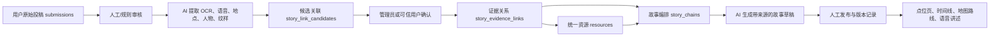

# “楚韵链迹”投稿串联与 AI 叙事方案

## 产品目标

用户上传的照片、文字、音频和地点记录不是一次性投稿，而是可持续积累的“文化证据”。系统把不同用户、不同时间、不同地点的证据关联到统一资源，再生成有出处、可修订、可继续补充的文化故事。

AI 可以参与识别、归类、关联建议和故事草拟，但不能覆盖原始投稿，也不能把未经审核的推测当作事实发布。

## 数据流



## 模块边界

### 1. 原始投稿层

继续使用 `submissions`，永久保存：

- 原始文件 `fileID`、用户、上传时间、地点和素材类型；
- 用户原文、授权范围和隐私状态；
- AI 审核结果与人工审核结果；
- 原始投稿不可被 AI 改写，只能追加分析结果。

### 2. 统一资源层

继续使用 `resources` 表示稳定对象，例如黄鹤楼、晴川阁、某种窗花纹样、某条历史路线。投稿可以关联一个或多个资源。

### 3. 证据关系层

新增 `story_evidence_links`：

```json
{
  "submissionId": "submission_xxx",
  "resourceId": "yellow-crane-tower",
  "relationType": "documents_inscription",
  "evidenceSummary": "用户照片记录了碑廊东侧题刻",
  "confidence": 0.91,
  "proposedBy": "ai",
  "status": "confirmed",
  "reviewedBy": "admin_uid",
  "createdAt": "serverDate"
}
```

关系先以候选状态保存，确认后才进入公开故事。这样可以支持“同一纹样出现在不同建筑”“同一人物关联多个地点”“同一地点在不同时期发生变化”等串联。

### 4. 故事链层

新增 `story_chains`，保存故事的结构而不是只保存一段 AI 文案：

- 标题、主题、地点范围和时间范围；
- 章节顺序和每章关联的资源、投稿、关系 ID；
- AI 草稿、人工修订稿、公开版本；
- 使用的模型、提示词版本、生成时间；
- 发布状态和版本号。

公开文案中的每个章节都必须能回到具体投稿或官方资源，不显示“无来源的 AI 结论”。

## AI 适合承担的工作

- 图片 OCR、音频转写、物体/纹样/建筑构件识别；
- 从用户描述中提取地点、人物、年代、事件和主题标签；
- 根据图像、文本、位置和时间提出“可能相关”的投稿；
- 对已确认的证据关系做章节编排和故事草拟；
- 生成不同长度的文字版、儿童版、路线讲解版和语音稿。

## AI 不应承担的工作

- 不直接删除、覆盖或改写用户原始投稿；
- 不自行决定历史事实是否成立；
- 不把低置信度关系直接公开；
- 不负责权限、积分、审核状态、兑换和核销；
- 不在浏览器里保存模型密钥。

## 云端实现方式

新增独立云函数 `storyWorker`，由服务端读取模型密钥并异步处理任务：

1. 投稿审核通过后写入 `story_jobs`；
2. `storyWorker` 读取任务和已授权素材；
3. 调用视觉、OCR、语音或大语言模型；
4. 将结构化结果写入 `story_link_candidates`；
5. 管理后台确认关联；
6. 确认关系进入 `story_evidence_links`；
7. 用户或管理员发起“生成故事”，AI 只读取已确认关系；
8. 草稿存入 `story_chains`，审核后发布。

模型供应商可以替换。首版重点是固定输入输出 JSON 结构和审核流程，不把业务逻辑绑定到某一个模型。

## 前端产品形态

- 点位详情增加“链迹故事”：时间线、地图和故事章节；
- 每章显示“资料来自 3 位用户、5 份投稿”，可展开查看来源；
- 用户投稿完成后提示“发现 2 条可能关联”，允许用户确认或忽略；
- 发现页增加“共同讲述”卡片，而不是把所有投稿平铺；
- 用户可补充某一章节缺失的照片、口述或地点信息；
- 管理端提供候选关联审核、故事草稿审核和版本回退。

## 推荐开发顺序

1. **人工关系 MVP**：先建立 `story_evidence_links`，管理员手动把投稿关联到资源，验证前端故事时间线。
2. **AI 影子模式**：AI 只生成候选关联，用户看不到，管理员比较准确率。
3. **半自动确认**：高置信度候选进入快速审核，低置信度要求人工补充。
4. **带来源故事**：仅用确认关系生成故事草稿，每章展示来源。
5. **个性化讲述**：根据用户位置、时间和兴趣生成游览顺序、语音稿与路线提示。

第一阶段不需要迁移或删除现有投稿，只需给新关系表增加引用。现有 `submissions` 和 `resources` 可以原样继续使用。
