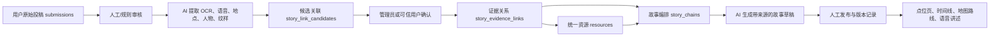

# “楚韵链迹”投稿串联与 AI 叙事方案

## 产品目标

用户上传的照片、文字、音频和地点记录不是一次性投稿，而是可持续积累的“文化证据”。系统把不同用户、不同时间、不同地点的证据关联到统一资源，再生成有出处、可修订、可继续补充的文化故事。

AI 可以参与识别、归类、关联建议和故事草拟，但不能覆盖原始投稿，也不能把未经审核的推测当作事实发布。

## 数据流



## 模块边界

### 1. 原始投稿层

继续使用 `submissions`，永久保存：

- 原始文件 `fileID`、用户、上传时间、地点和素材类型；
- 用户原文、授权范围和隐私状态；
- AI 审核结果与人工审核结果；
- 原始投稿不可被 AI 改写，只能追加分析结果。

### 2. 统一资源层

继续使用 `resources` 表示稳定对象，例如黄鹤楼、晴川阁、某种窗花纹样、某条历史路线。投稿可以关联一个或多个资源。

### 3. 证据关系层

新增 `story_evidence_links`：

```json
{
  "submissionId": "submission_xxx",
  "resourceId": "yellow-crane-tower",
  "relationType": "documents_inscription",
  "evidenceSummary": "用户照片记录了碑廊东侧题刻",
  "confidence": 0.91,
  "proposedBy": "ai",
  "status": "confirmed",
  "reviewedBy": "admin_uid",
  "createdAt": "serverDate"
}
```

关系先以候选状态保存，确认后才进入公开故事。这样可以支持“同一纹样出现在不同建筑”“同一人物关联多个地点”“同一地点在不同时期发生变化”等串联。

### 4. 故事链层

新增 `story_chains`，保存故事的结构而不是只保存一段 AI 文案：

- 标题、主题、地点范围和时间范围；
- 章节顺序和每章关联的资源、投稿、关系 ID；
- AI 草稿、人工修订稿、公开版本；
- 使用的模型、提示词版本、生成时间；
- 发布状态和版本号。

公开文案中的每个章节都必须能回到具体投稿或官方资源，不显示“无来源的 AI 结论”。

## AI 适合承担的工作

- 图片 OCR、音频转写、物体/纹样/建筑构件识别；
- 从用户描述中提取地点、人物、年代、事件和主题标签；
- 根据图像、文本、位置和时间提出“可能相关”的投稿；
- 对已确认的证据关系做章节编排和故事草拟；
- 生成不同长度的文字版、儿童版、路线讲解版和语音稿。

## AI 不应承担的工作

- 不直接删除、覆盖或改写用户原始投稿；
- 不自行决定历史事实是否成立；
- 不把低置信度关系直接公开；
- 不负责权限、积分、审核状态、兑换和核销；
- 不在浏览器里保存模型密钥。

## 云端实现方式

新增独立云函数 `storyWorker`，由服务端读取模型密钥并异步处理任务：

1. 投稿审核通过后写入 `story_jobs`；
2. `storyWorker` 读取任务和已授权素材；
3. 调用视觉、OCR、语音或大语言模型；
4. 将结构化结果写入 `story_link_candidates`；
5. 管理后台确认关联；
6. 确认关系进入 `story_evidence_links`；
7. 用户或管理员发起“生成故事”，AI 只读取已确认关系；
8. 草稿存入 `story_chains`，审核后发布。

模型供应商可以替换。首版重点是固定输入输出 JSON 结构和审核流程，不把业务逻辑绑定到某一个模型。

## 前端产品形态

- 点位详情增加“链迹故事”：时间线、地图和故事章节；
- 每章显示“资料来自 3 位用户、5 份投稿”，可展开查看来源；
- 用户投稿完成后提示“发现 2 条可能关联”，允许用户确认或忽略；
- 发现页增加“共同讲述”卡片，而不是把所有投稿平铺；
- 用户可补充某一章节缺失的照片、口述或地点信息；
- 管理端提供候选关联审核、故事草稿审核和版本回退。

## 推荐开发顺序

1. **人工关系 MVP**：先建立 `story_evidence_links`，管理员手动把投稿关联到资源，验证前端故事时间线。
2. **AI 影子模式**：AI 只生成候选关联，用户看不到，管理员比较准确率。
3. **半自动确认**：高置信度候选进入快速审核，低置信度要求人工补充。
4. **带来源故事**：仅用确认关系生成故事草稿，每章展示来源。
5. **个性化讲述**：根据用户位置、时间和兴趣生成游览顺序、语音稿与路线提示。

第一阶段不需要迁移或删除现有投稿，只需给新关系表增加引用。现有 `submissions` 和 `resources` 可以原样继续使用。

## 第一阶段实现记录（2026-08-12）

已完成“人工关系 MVP”：

- 新增 `story_evidence_links`，保存已确认或已归档的投稿—资源关系；
- 新增 `story_evidence_logs`，记录确认、重新确认和归档，不执行物理删除；
- `adminSubmissions` 新增链迹工作台接口，只有 `ADMIN_UIDS` 管理员可调用；
- 管理后台新增“链迹关联”，仅允许选择 `approved` 投稿和 `published` 资源；
- `appCore/getStoryEvidence` 仅返回 `confirmed` 关系，并再次验证来源投稿仍为 `approved`；
- 用户在地图点位浮窗点击“链迹”，可查看资料时间线、关系说明、媒体和记录者公开昵称；
- 用户端支持“关系图谱 / 资料时间线”双视图；图谱按“文化资源 → 关系类型 → 已审核投稿”动态生成，节点可点击查看依据；
- 公共响应不返回投稿者 UID、文件 ID、管理员 UID 或内部审核字段。

两个新增集合应在 CloudBase 数据库权限中设置为：

```json
{
  "read": false,
  "write": false
}
```

前端统一通过云函数读取脱敏结果，不需要客户端直读数据库。第一阶段没有接入 AI；下一阶段只生成候选关系，不自动公开。

## 第二阶段实现记录（2026-08-15）

已完成“AI 影子模式”：

- 投稿表新增明确的 AI 分析授权、授权版本、授权范围与处理状态；授权默认关闭；
- 只有审核通过且用户明确授权的投稿才能由管理员创建 AI 分析任务；
- 模型只接收投稿公开文字、素材类型、地区和已发布资源的脱敏清单；
- `ai_link_candidates` 保存候选关系，模型不能直接写入正式链迹；
- 管理员后台可以生成、检查、修改说明、确认或驳回候选；
- 确认候选时再次验证投稿、资源和关系类型，并在事务中同步写入正式链迹与审核日志；
- 旧投稿缺少授权字段时保持未授权，不执行迁移、不删除数据。

`ai_link_candidates` 也应在 CloudBase 数据库权限中设置为：

```json
{
  "read": false,
  "write": false
}
```

## 第三阶段实现记录（2026-08-15）

已完成“带来源故事草稿”：

- `storyWorker` 只读取 `status=confirmed` 的正式链迹，并再次确认来源投稿仍为 `approved`；
- 故事 JSON 合约要求每个章节至少引用一个真实 `story_evidence_links` ID，模型不能引用清单外来源；
- AI 结果以 `draft` 状态写入 `story_chains`，不能由模型直接发布；
- 管理后台新增“故事草稿”，支持逐章编辑、核对来源、人工发布和归档；
- 发布事务会再次验证文化资源、链迹关系和来源投稿，并写入 `story_chain_logs`；
- 新版本发布后，旧公开版本改为 `superseded`，保留追溯记录；
- 用户端链迹窗口新增“故事讲述”，每章显示可点击的来源标签，可返回资料时间线查看原始记录。

以下集合的客户端权限应设置为禁止直接读写：

- `story_chains`
- `story_chain_logs`

公开故事统一经 `appCore/getStoryEvidence` 脱敏读取；草稿、管理员、模型和内部版本字段不会返回前端。

## 第四阶段实现记录（2026-08-15）

已完成“投稿内短故事与质量门槛”：

- 故事改为适合投稿卡片阅读的短结构：短标题、短导语、最多两段正文，减少空泛套话；
- 生成前先检查已确认来源、现场描述和关系说明，资料不足时返回具体补充建议，不调用模型；
- 已发布故事由 `appCore/listPublicSubmissions` 脱敏后挂到对应投稿，发现页和投稿详情可直接阅读；
- 投稿详情会提示当前链迹还缺少什么，但不会用未经核实的内容强行生成故事；
- “关系图谱”改为纵向的“链迹关系”，按关系类型展示审核资料，取消深色横向大画布和横向滚动；
- 原有链迹时间线、来源回溯、评论、点赞、投稿与审核接口保持不变。

下一阶段可在此基础上增加用户补充入口和故事版本反馈；个性化讲解、路线语音等仍放在已发布故事稳定之后。

## 第五阶段实现记录（2026-08-15）

已完成“简单补充入口与材料版本”：

- 投稿详情只保留一个主要入口“补充这段链迹”，点击后直接选择文件；
- 原有细分补充位置没有删除，默认折叠在“更多补充方式”中；
- 修正补充状态归属，其他用户已通过的资料不会再被错误显示成“我已完成”；
- 补充资料继续复用原有云存储、管理员审核、积分和日志链路；
- 审核通过会递增投稿的 `storyMaterialRevision` 并记录 `storyMaterialUpdatedAt`；
- 故事生成输入包含已审核补充的类型与材料版本，新增资料后会生成新的任务版本，不读取旧草稿缓存；
- AI 只知道补充资料的类型，不会猜测尚未做 OCR、转写或图像识别的文件内容；
- 故事工作台会标出“有新补充待更新”，管理员发布后形成新的公开故事版本。

用户故事纠错反馈与个性化讲解仍属于后续阶段。
